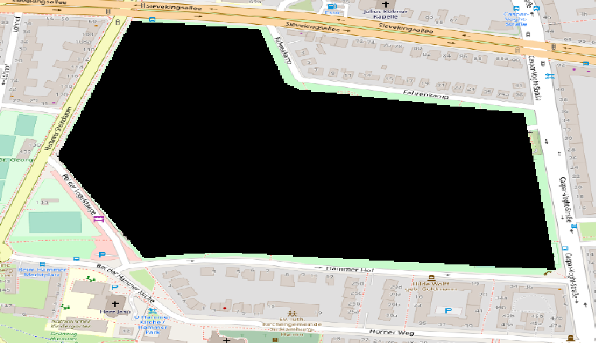
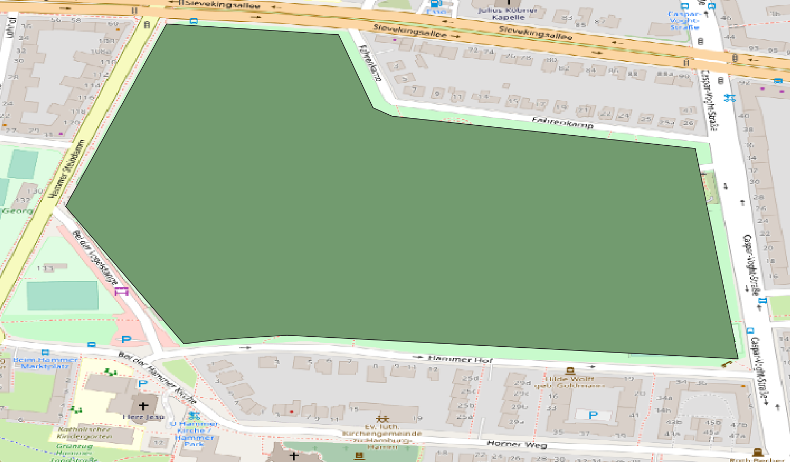

## Definition of Layer

Layers represent the *environment* in which agents *live*. They serve as surrounding for their dependent agents. In this context, they are responsible to create their agents. Do not confuse layers with the [``Environment``-type](environments/index.md) that is a data structure that is used for moving and exploring spatial objects ([agents](agent.md) and [entities](entity.md)). A layer may however use an environment that is used by its agents. 

Moreover, layers may hold and provide data, depending on their type.  They offer possibilities for input of various data formats ([see more information about possible inputs](../data-sources/index.md)). 

Layers are the central model element in a MARS model and are automatically generated by the MARS runtime system and mutual dependencies between different layers are resolved. They require to be registered in the [model description](model.md).

In MARS, the following layers are distinguished
* [Basic Layer](#basic-layer)
* Layers with dependencies or activity
  * [Dependent Layer](#dependent-layer)
  * [Active Layer](#active-layer)
* Data Layer
  * [Vector Layer](#vector-layer)
  * [Raster Layer](#raster-layer)

The layer ``ILayer`` contract is structured as follows:

```plantUml
interface IModelObject {
}

interface ILayer {
    InitLayer(layerInitData:TInitData, registerAgentHandle:RegisterAgent, unregisterAgentHandle:UnregisterAgent) : bool
    GetCurrentTick() : long
    SetCurrentTick(currentStep:long) : void
}
IModelObject <|-- ILayer

interface IDataLayer {
}
ILayer <|-- IDataLayer

```

### Basic Layer

To define a layer the ``ILayer`` interface must be implemented **or** inherited from the existing abstract implementation `AbstractLayer`. 

In the model code, a ``using`` import for the namespace ``Mars.Components.Layers`` must be added to the own model file.
```C#
using Mars.Components.Layers;
```

Then a new layer type can be defined in the form of a class that inherits from the abstract class `AbstractLayer`:

```C#
public class MyLayer : AbstractLayer
{
    	public override bool InitLayer(TInitData layerInitData, RegisterAgent registerAgentHandle, UnregisterAgent unregisterAgentHandle)
	{
	    base.InitLayer(layerInitData, registerAgentHandle, unregisterAgentHandle);
		// Do your initialization logic here.
		return true;
	} 
}
```
The `InitLayer` method can be used to execute custom logic, to initialize [Environments](environments/index.md) or to [Spawning](spawning.md) agents.

> Please note to call the base implementation ``base.InitLayer(layerInitData, registerAgentHandle, unregisterAgentHandle);`` to ensure correct initialization along the class hierarchy.


Layer needs to be registered in the ```ModelDescription``` by calling the ``AddLayer<TLayer>()`` in your entry point ``Main()`` method, to be an active part of the simulation. Active means here that the layer will be managed (initialized and referenced in other active entities) by the MARS framework.

```c#
private static void Main(string[] args)
{
 var description = new ModelDescription();
 description.AddLayer<MyLayer>();
 //...
}
```

---


### Dependent Layer

If layers needs references to other layer for object and direct agent interaction or just to access data layer, the definition of dependent layers is necessary. Dependent layers are acquired by defining the layer instance as a **property**. MARS resolves this dependency by using ``PropertyInjection`` to **automatically** and assigns the dependent layer to this property.

> Cyclic dependencies between Layer can be defined as well, but this is an indication for a bad conceptual design.

```C#
public class MyLayer : AbstractLayer
{
    [PropertyDescription]
	public MyDependentLayer DependentLayer { get; set; }
}
```
---

### Active Layer

If the layer requires to act within the simulation, it can be made active, which provides the possibility to act before, after and within the tick. The interface ``ISteppedActiveLayer`` will get ticked by the LayerContainer, just as the average ITickClient. In Addition it provides to more methods which allow to hook into the moment just before and after a tick.

```C#
public class MyLayer : ISteppedActiveLayer
{
        public void Tick()
        {
            //do something this tick
        }

        public void PreTick()
        {
            //do something bevore the tick
        }

        public void PostTick()
        {
            //do something after the tick
        }
}
```
The base implementation of the ``ISteppedActiveLayer`` interface is the ``AbstractActiveLayer`` where each step phase (pre, tick, post) can be override and activated for a stepwise behaviour on a layer type.

---

### Data Layer


There are different layer types provides, to integrate data into the model and make it available for agents. To represent spatial components of the model MARS offers raster and vector layers, which can be used to represent the simulation world under consideration (e.g. temperatures, landscapes, buildings, roads, passive objects). All layers can be found in the package ``Mars.Components.Layers``.

In the model code a ``using`` import for the namespace ``Mars.Components.Layers`` must be added to the own model file, if not already done.
```C#
using Mars.Components.Layers;
```

#### Raster Layer
<a name="raster_layer"></a>

Raster layer and grid layer are able to process grid and raster data and can be viewed similar to a 2D matrix. Real numerical values are stored in a n x m matrix and have a certain semantic nominal value.

The `IRaster` contract provides the following functionalities:

```plantUml
interface IRaster {
    CalculateStatistics() : void
}
interface "IRaster`1"<TValue> {
    CurrentBand : int <<get>>
    NumBands : int <<get>>
    Width : int <<get>>
    Height : int <<get>>
    CellHeight : double <<get>> <<set>>
    CellWidth : double <<get>> <<set>>
    StartColumn : int <<get>>
    StartRow : int <<get>>
    EndColumn : int <<get>>
    EndRow : int <<get>>
    NoDataValue : double <<get>> <<set>>
    Maximum : double <<get>>
    Mean : double <<get>>
    Minimum : double <<get>>
    ReadBlock(xOff:int, yOff:int, sizeX:int, sizeY:int) : IRaster<TValue>
    WriteBlock(blockValues:IRaster<TValue>, xOff:int, yOff:int, xSize:int, ySize:int) : void
}
"IRaster`1" "<double>" <|-- IRaster
"IRaster`1" --> "LowerLeft" Position
"IRaster`1" --> "UpperRight" Position

interface IRasterLayer {
    GetValueByGeoPosition(coordinate:Position) : double
    GetValueByGridPosition(coordinate:Position) : double
}
IDataLayer <|-- IRasterLayer
IRaster <|-- IRasterLayer
IDataSet <|-- IRasterLayer

```



The raster above shows a sample black area which is associated to concrete pixel value. This value can be used to solve problems such as, _querying a coordinate around the park_.

To define a grid layer a new layer must inherit from the abstract ``RasterLayer``:

```C#
public class MyRasterLayer : RasterLayer
{

}
```

The raster layer offers various operations for processing matrix data and allows e.g. k-NN ``Explore`` queries for nearby cells and coordinates whose nuclei match a condition.

The `explore` is used to query all raster cells that are within a `radius` and match a selection criterion.

```C#
MyRasterLayer MyRaster { get; set; }
...
var source = Position.CreatePosition(30,40);
var result MyRaster.Explore(source, 10, 5);
```

The call `Explore(source, 10, 5)` returns a sequence of the first `5` cells with their values that are within the `radius` of 10 steps starting from coordinate `(30,40)`.

> Please note that the semantic of the `radius` you specify for the `Explore` depends on the distance function used within the `raster-layer` (`Haversine` with `meter` for Geospatial, `Chebyshev` for Grid).

A fourth argument can be used to _optionally_ define a selection predicate to search for specific cells that meet a condition.

```C#
MyRasterLayer MyRaster { get; set; }
...
var source = Position.CreatePosition(30,40);
var result MyRaster.Explore(source, 10, -1, cell => cell > 10);
```
The call `Explore(source, 10, 5, cell => cell > 10)` queries for all cells (`-1`) in the radius ofn `10` whose cell value is greater than `10`.

#### Vector Layer

Vector layers are used to map vector objects that can be represented by points, lines or areas. Vector objects are the most commonly used types for modeling the simulated environment.
 
The vector layer above shows an example vector layer, building the closed area to represent the park to solve problems such as _Checking for position, whether they are inside the park or not_.  
To define a vector layer, a new layer must inherit from the abstract VectorLayer:

The `IVectorLayer` contract is providing the following functionalities:

```plantUml

interface IVectorLayer {
    SerializeJson() : string
    SerializeFeaturesJson() : IEnumerable<string>
}
interface "IVectorLayer`1"<T> {
    CurrentTsIndex : int <<get>>
    GetClosestPoint(gpsCoordinate:Position, maxDistance:double, predicate:Func<T, bool>) : Position
    Distance(featureIndex:int, coords:IEnumerable<Position>) : double
    IsPointInside(coordinate:Position) : bool
    IsMultiPointInside(coords:IEnumerable<Position>) : bool
    IsLineStringInside(coords:IEnumerable<Position>) : bool
    IsMultiPointCrossing(coords:IEnumerable<Position>) : bool
    IsLineStringCrossing(coords:IEnumerable<Position>) : bool
    IsMultiPointIntersecting(coords:IEnumerable<Position>) : bool
    IsLineStringIntersecting(coords:IEnumerable<Position>) : bool
    IsMultiPointOverlapping(coords:IEnumerable<Position>) : bool
    IsLineStringOverlapping(coords:IEnumerable<Position>) : bool
    GetAccumulatedPathRating(source:Position, target:Position, distance:int) : double
    GetAccumulatedPathRating(source:Position, distance:int, bearing:double) : double
    GetTimeseriesDataForCurrentTick() : object
    GetFromDataTable(featureId:int, key:string) : object
    AddToDataTable(featureId:int, key:string, value:object) : void
}
class "Collection`1"<T> {
}
class "SortedList`2"<T1,T2> {
}
ILayer <|-- IVectorLayer
IVectorLayer --> "GeometryCollection" IGeometryCollection
IVectorLayer --> "Features<IVectorFeature>" "Collection`1"
IVectorLayer <|-- "IVectorLayer`1"
IDataLayer <|-- "IVectorLayer`1"
"IVectorLayer`1" --> "TimeSeriesData<DateTime,double>" "SortedList`2"
"IVectorLayer`1" --> "CoordinateReferenceSystem" ICRSObject
```

```csharp
public class MyVectorLayer : VectorLayer
{

}
```

Features of vector layers (points, lines, surfaces) can be individually abstracted by a model type in MARS. The ``VectorLayer`` offers a more abstract implementation ``VectorLayer<TFeatureType>`` for the definition of model types which can be initialized by concrete features from a vector input with data. 

An example for an abstract feature can look like this:

```csharp
public class MyVectorFeature : IVectorFeature
{
    public double MyFeatureValue { get; set; }
    
    public void Init(IFeature feature)
    {
        MyFeatureValue = feature.Attributes["valueAttributeName"].Value<double>();
    }
}
```

If the ``MyVectorLayer`` is queried, concrete ``MyVectorFeature`` objects are returned and can be processed.

```csharp
myVectorLayer.Explore(new[] {9.99967, 53.55285}, 100, 10, myVectorFeature =>
{
    return myVectorFeature.MyFeatureValue > 20;
});
```