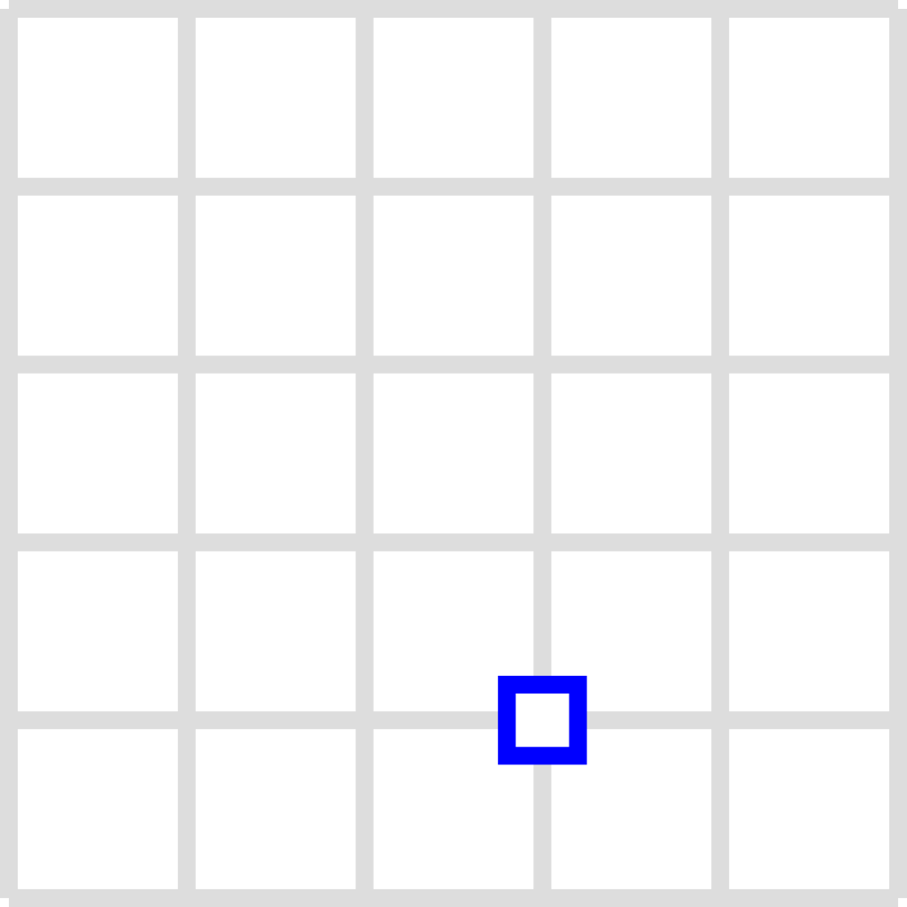
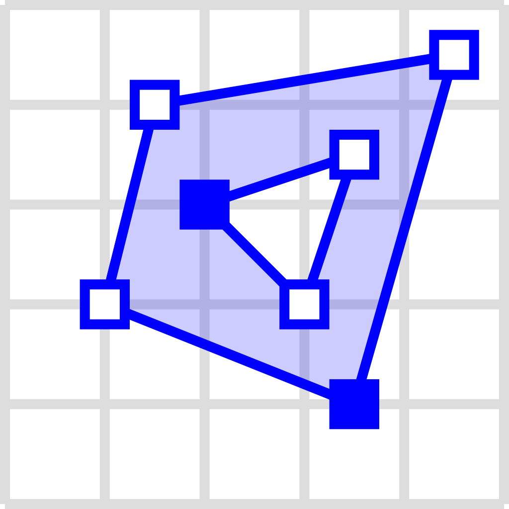
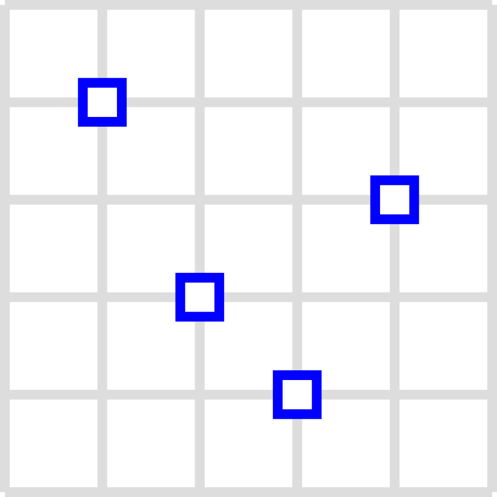
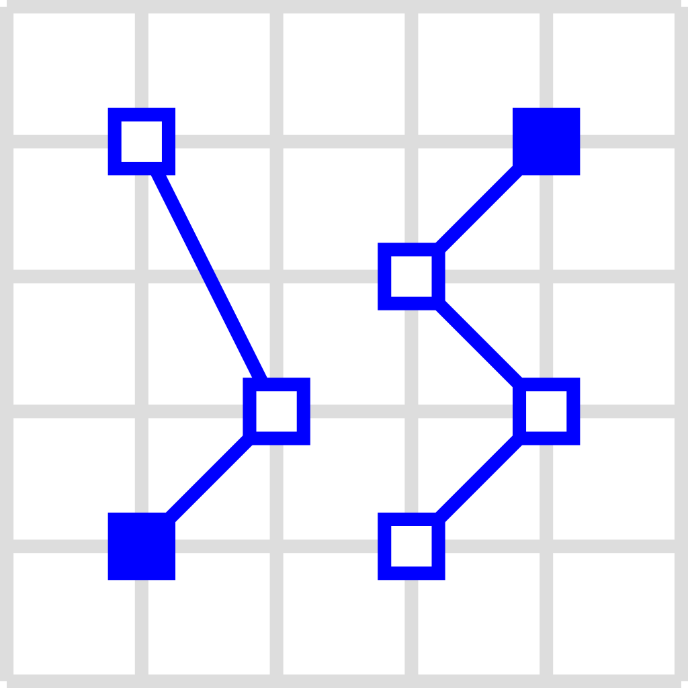
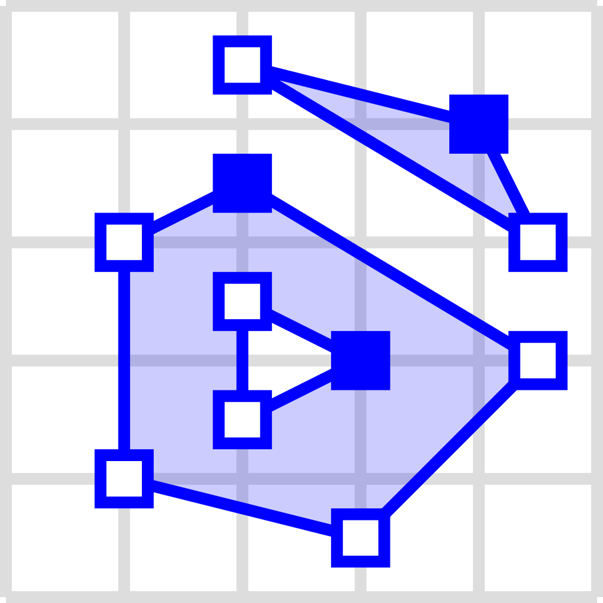

# Geospatial Data

Geospatial data object containing a spatial reference in the form of coordinates. Often these are geocoordinate with the coordinate reference system `srid:EPSG:4326`.


## Obtaining useful Data

A useful resource for geospatial data about Hamburg is [GeoPortal](https://geoportal-hamburg.de/geo-online/). (Other cities/countries have their own agencies, such as the Federal Office of Statistics, that provide local, geospatial data). Follow these steps to obtain raster- and vector-layer data at GeoPortal Hamburg:

1. Click on Themen → Fachdaten
2. From the list, choose the type of information you wish to obtain raster- or vector-data on and click the information icon next to it.
3. In the info card that pops up click on `WMS` address if available.
4. If not available, then click on `Weitere Metadaten`. This will forward you to metaver.de (MetadatenVerbund).
   1. On [Metaver](https://metaver.de), click on one of the links under ``Verweise`` or `Weitere Verweise`.
5. You will be directed to a site that contains an XML document. Copy the site's URL and paste it into QGIS to display the geodata.

## Prepare Data

LIFE can consume multiple geospatial data format such as `GeoJSON (*.geojson)`, `GeoPackage (*.gpgk)`, `GraphML (*.graphml)` or `ESRI Shapefile (*.shp)` as for vector layers, or `Raster CSV (*.csv)`, `ASCII Grid (*.asc)` for raster-layer. 

To prepare non-conforming geospatial data for your model, you can convert it with **QGIS** as a useful public GIS processing tool.

1. Download and install [QGIS](https://qgis.org/en/site/forusers/download.html).
2. Load your geospatial data into the QGIS application. This will produce one or more layer(s) in the Layer window (bottom left).
3. Export the layer by opening the context-entries and selecting `Export`.
4. Select an appropriate format, mentioned above or described [here](../configuration/layer_config.md).


## Geospatial Data Types

The MARS runtime system is able to work with process geoinformation and geodata in multiple formats. Upon execution of a simulation, the data stored in such files are converted to graphs, consisting of nodes and edges.

### GeoJSON

GeoJSON is a format for encoding a variety of geographic data structures. Typically, a set of data structures is held within a `FeatureCollection` made up of `Features`:

```json
{ "type": "FeatureCollection",
  "features": [
    { "type": "Feature",
      "geometry": {"type": "Point", "coordinates": [102.0, 0.5]},
      "properties": {"prop0": "value0"}
    },
    { "type": "Feature",
	  "geometry": {
        // insert geometry types here
      }
    },
    { "type": "Feature",
      "geometry": {
        // insert geometry types here
      }
    }
  ]
}
```

Below is a description of the geometry types supported in GeoJSON:

**Point:** a single point on a coordinate system.

Example:

```json
{ 
    "type": "Point",
    "coordinates": [30, 10]
}
```

___

**LineString:** a set of points connected by lines. 

```json
{ 
    "type": "LineString",
    "coordinates": [
        [30, 10], [10, 30], [40, 40]
    ]
}
```

The key `coordinates` contains a set of points, each of which connects to the one listed before it.

___

**Polygon:** a set of points connected by lines that form a closed shape.

```json
{ 
    "type": "Polygon",
    "coordinates": [
        [[35, 10], [45, 45], [15, 40], [10, 20], [35, 10]],
        [[20, 30], [35, 35], [30, 20], [20, 30]]
    ]
}
```

This is an example of a polygon within a polygon, creating a cut-out within the outer polygon. It is also possible to create a single filled-out polygon.

___

**MultiPoint:** a set of multiple unconnected points.

```json
{ 
    "type": "MultiPoint",
    "coordinates": [
        [10, 40], [40, 30], [20, 20], [30, 10]
    ]
}
```

___

**MultiLineString:** a set of multiple lines made up of multiple points.

```json
{ 
    "type": "MultiLineString",
    "coordinates": [
        [[10, 10], [20, 20], [10, 40]],
        [[40, 40], [30, 30], [40, 20], [30, 10]]
    ]
}
```

___

**MultiPolygon:** a set of polygons.

```json
{ 
    "type": "MultiPolygon",
    "coordinates": [
        [
            [[40, 40], [20, 45], [45, 30], [40, 40]]
        ],
        [
            [[20, 35], [10, 30], [10, 10], [30, 5], [45, 20], [20, 35]],
            [[30, 20], [20, 15], [20, 25], [30, 20]]
        ]
    ]
}
```

___

Here are examples of how these geometry types are represented visually:

|                            Point                             |                          LineString                          |                           Polygon                            |                          MultiPoint                          |                       MultiLineString                        |                         MultiPolygon                         |
| :----------------------------------------------------------: | :----------------------------------------------------------: | :----------------------------------------------------------: | :----------------------------------------------------------: | :----------------------------------------------------------: | :----------------------------------------------------------: |
|  |  |  |  |  |  |


For more information on GeoJSON, please visit [RFC7946](https://tools.ietf.org/html/rfc7946) or https://datatracker.ietf.org/wg/geojson/charter/.

### GraphML

GraphML is an XML-based data format for representing graphs. For example, MARS can use geodata from a GraphML file to populate a VectorLayer or other layer type for agents to move on.

GraphML files that contain geodata can be generated using [OSMnx](https://osmnx.readthedocs.io/en/stable/). A useful tutorial on how to work with OSMnx can be found [here](https://geoffboeing.com/2016/11/osmnx-python-street-networks/).

:::note
GraphML cannot be visualized in QGIS.
:::

### Shapefile

Shapefile is a geospatial vector data format for GIS software that is also used within MARS runtime system models. They consist of multiple files, three of which are mandatory:

1. `.shp`: shape format; the feature geometry itself
2. `.shx`: shape index format; a positional index of the feature geometry to allow seeking forwards and backwards quickly
3. `.dbf`: attribute format; columnar attributes for each shape, in dBase IV format

For more information on Shapefile specifications, please see the [ESRI technical description](https://www.esri.com/content/dam/esrisites/sitecore-archive/Files/Pdfs/library/whitepapers/pdfs/shapefile.pdfdocs/).

### Geopackage

GeoPackage is an open, standards-based, platform-independent, portable, compact format for transferring geospatial information. It contains data and geodata in a SQLite database file. For more information, please see the [Geopackage homepage](https://www.geopackage.org).

