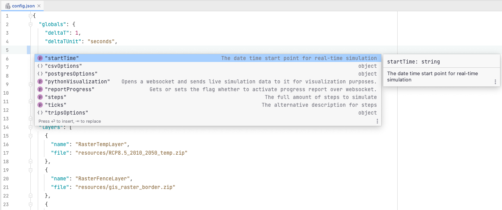

# Installation

The MARS framework is written in C#/.NET, so you need to install the [.NET-SDK](https://dotnet.microsoft.com/en-us/download) on your computer to develop MARS models.

The easiest way is to install [JetBrains Rider](https://www.jetbrains.com/rider/) as an Integrated Development Environment (IDE). This will handle the installation of .NET for you and give an easy way to execute and debug your models. Though a license is required for using Rider, which is [free for students](https://www.jetbrains.com/community/education/#students).


:::info

For a more playful introduction into modelling with MARS, have a look at the [MARS Explorer](mars-explorer.md), which provides a simpler IDE suited for smaller models and first steps into MARS.

:::

## NuGet Packages


The MARS framework is organized in [NuGet packages](https://www.nuget.org/packages/Mars.Life.Simulations/). To install the framework in your application, use the public `nuget` feed from Microsoft and make your you app is compatible with `netstandard2.0`.

The runtime system is available as a public NuGet package and can simply be added to your project using the `dotnet` CLI with:

```bash
dotnet add package Mars.Life.Simulations
```

Or if you are using an IDE:

- For Visual Studio, right-click on the **References** item in your solution folder, and select **Manage NuGet Packages**.
- For JetBrains Rider, click on NuGet package management below.

Search for `Mars.Life.Simulations` and select <kbd>Install</kbd>.


## `config.json` validation in Rider

The simulation configuration is generally stored in a [`config.json` file](./configuration/sim_config_options.md). Because JSON is a pure data format and not a schema-based format, it has no native support for schema definitions. But it would be nice to have a guideline how to fill the `config.json`, knowing which options are available and which parts of configuration are mandatory.

For this purpose, we use [_JSON Schema_](https://json-schema.org/). It is supported by multiple IDEs; the following describes a short introduction how to use it in Rider.

Open the `JetBrainsRider > Preferences` menu. Go to `Languages & Framework > Schemas and DTDs > JSON Schema Mappings`. Paste the URL of the MARS schema to `Schema file or URL`:

```
https://mars-group-haw.github.io/mars_config.schema.json
```

Use the preselected `Schema version: JSON Schema version 4`. 

Add a `File path pattern` for files that are named `config.json`. `Save`.


That's it. Know you have full schema support for manipulation on your simulation configuration json-file.


