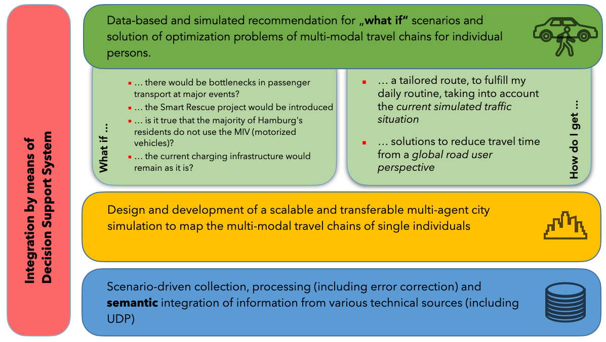
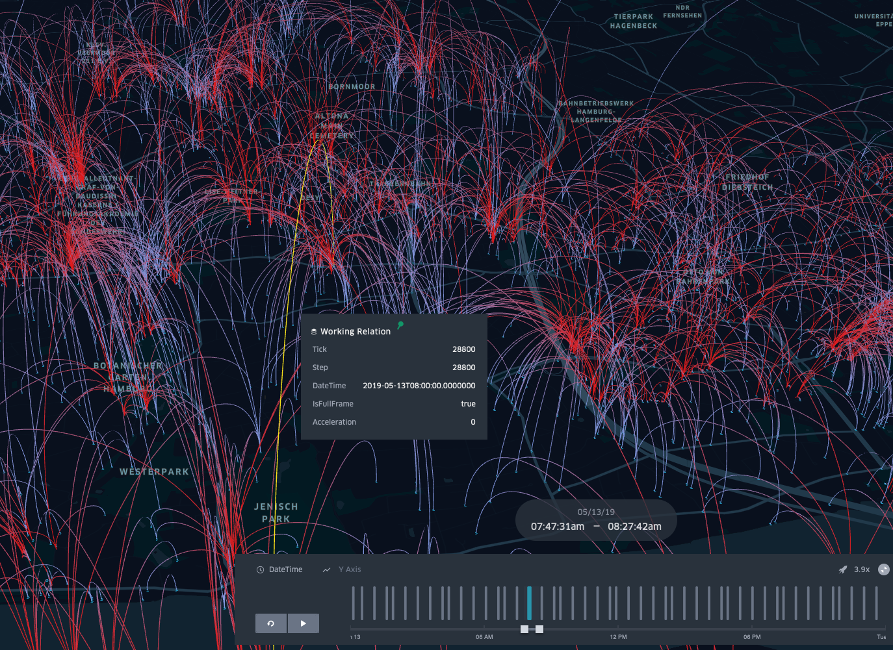

#  SmartOpenHamburg

_SmartOpenHamburg_ (SOH) is a microscopic, multi-modal mobility simulation for large-scale scenarios. The model can be used to build digital twins for decisions support systems.

The model implements mobility behaviour utilized by individual agents or by usinng life cycle of citizens. Agents travel to different *defined* destinations along *streets*, *sidewalks*, *bicycle* paths and *ferry connections* affecting each other.

## Goals 

The goals of SOH are the conception and realization of a decision support system for large-scale mobility scenarios.

## Example 

The following video shows an example scenario using ``Citizen`` agents and the [daily schedule model](agents.md) for the urban area in Altona Hamburg:

> [!Video https://www.youtube.com/embed/7w0kmC8R3FE]

## Lifecycle

On the way, people can use different modalities to achieve their goals or use publicly available resources. 
The life cycle of each agent consists of a sequence of consumed services and dayplanning targets given by points of interests (POI) marked in the city.

The figure below shows the synthetic ``work`` target selection based on the provided public land used services.

