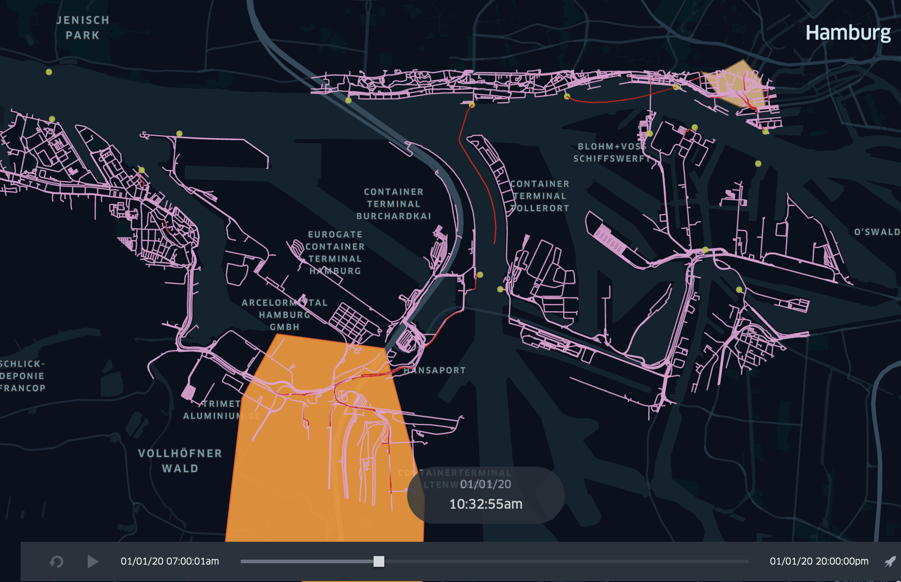
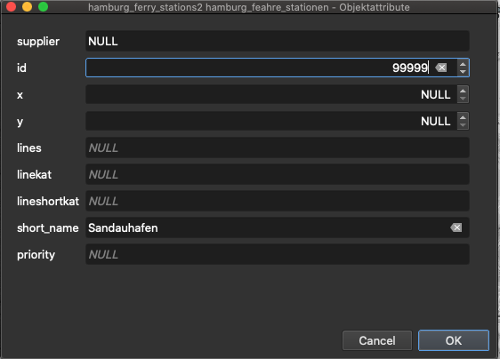
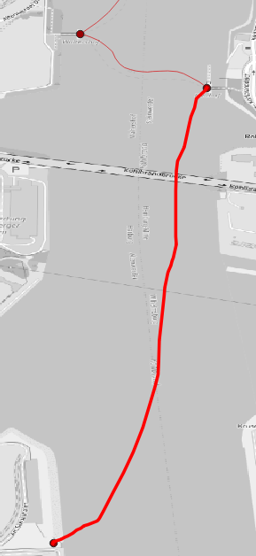
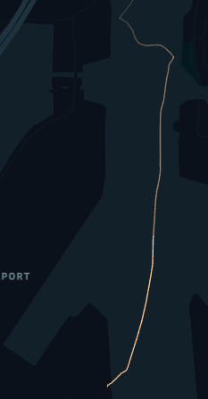

import Tabs from '@theme/Tabs';
import TabItem from '@theme/TabItem';

# FerryTransfer

[💾 Download of the model](https://github.com/MARS-Group-HAW/model-soh-ferrytransfer/releases)

The _FerryTransfer_ scenario creates a crowd of moving dock workers moving from a specified source point towards a specified target such as a randomly selected container terminal. They move within walking distance and use available ferry services that stop at the docks at regular intervals. 
The default setup in each box is shown in the following figure.



Ferries and dock workers move along the ferry lines and public sidewalks. Timings of ferries, new or re/moved ferry stations can be investigated to optimize the flow of passengers.

## Start the Simulation

To run this scenario follow the instructions of your operating system.

<Tabs>
<TabItem value="mac_linux" label="macOS & Linux" default>

To start the box on Unix-based systems, execute the following command (the `config.json`-file in the same folder is used):

```bash
./SOHFerryTransferBox
```

Optionally a different external simulation config can be used with the ``--sm`` parameter:

```bash
./SOHFerryTransferBox --sm config.json
```

:::caution
There may be problems with the verification of the box and additional files with the extension ``*.dylib`` and ``*.dll``. Please execute the following command to make them accessible in your terminal:
```bash
xattr -d com.apple.quarantine ./SOHFerryTransferBox
```
:::

</TabItem>
<TabItem value="win" label="Windows">

For Windows users, start the box by calling the following command (the `config.json`-file in the same folder is used):

```bash
SOHFerryTransferBox.exe
```

Optionally a different external simulation config can be used with the ``--sm`` parameter:

```bash
SOHFerryTransferBox.exe --sm config.json
```
</TabItem>
</Tabs>

---

As soon as the box starts, it shows you the current parameterization and stops the simulation.  Results are stored as trajectories of the agents and can be visualized.

The following video shows an example scenario for simulating `DockWorker` using the `Ferry` traffic to move towards a randomly selected target in the Hamburg harbor area: 

<iframe width="560" height="315" src="https://www.youtube.com/embed/muBlvUj2jwA" title="YouTube video player" frameborder="0" allow="accelerometer; autoplay; clipboard-write; encrypted-media; gyroscope; picture-in-picture; web-share" allowfullscreen></iframe>


### Dock Worker Scheduling 

Dockworkers can be created at runtime of the simulation and can be set with source and destination coordinates. We use so-called agent profiles for scheduling, which represent several categories of dockworkers, to keep the setting of the scenario as simple as possible.
 
 * The ``startTime`` (including) and the ``endTime`` (exclusive) each indicate the lower and upper interval bounds in hours of the day. It defines the time range of the day when new dockworkers are created in the simulation and should move towards a target.
* The ``spawningIntervalInMinutes`` (e.g. ``30``, for every half hour) allows to repeat the creation of new dockworkers from the ``startTime``. It specifies, after how many minutes new dockworkers should be created.
* The number of Dockworkers created can be set using the ``spawningAmount`` field (e.g. ``3`` for three new workers) 
* To describe spawning location and the moving target, the scheduler offers two different parameterizations:
    * A concrete source and destination coordinate can be defined in ``WGS84:4326`` notation via the fields ``sourceX`` (longitude) and ``sourceY`` (latitude) for the source or ``destinationX``(longitude) and ``destinationY`` (latitude) for defining the movement target (e.g. ``9.95253, 53.54907``).
    * A source geometry can be defined via the ``source`` field (see polygon areas in the figure above) using the ``WKT`` (well-known-text) format with ``WGS84:4326`` notation. It designates areas, lines, and points in the simulation world (e.g. B. ``POLYGON((9.976880157282743 53.5447212390353,9.983403289606962 53.54446623736498,9.980656707575712 53.54240066721653,9.976880157282743 53.5447212390353))``). For lines and polygons (areas) the model selects **equally distributed randomly** a coordinate that either lies along the line or is inside the described area. A helpful tool to define own WKT vector or selecting coordinates is the online [OpenLayers](http://dev.openlayers.org/examples/vector-formats.html) tool.

A full example of such a scheduling configuration is showed below and describes the setting above:

|startTime|endTime|spawningIntervalInMinutes|spawningAmount|gender|mass|perceptionInMeter|source                                                                                                                                                                                                                                                                                       |destination                                                                                                                                                                                                                                                                                                                     |
|---------|-------|-------------------------|--------------|------|----|------------------|---------------------------------------------------------------------------------------------------------------------------------------------------------------------------------------------------------------------------------------------------------------------------------------------|--------------------------------------------------------------------------------------------------------------------------------------------------------------------------------------------------------------------------------------------------------------------------------------------------------------------------------|
|7:00     |18:00  |10                       |10            |female|60  |1.0               |MULTIPOLYGON (((9.97859976984082 53.543765731511,9.98209851718183 53.5428480272904,9.98651496874344 53.5427906707766,9.98565462103663 53.5456584964659,9.98261472580592 53.5477233309623,9.97791149167537 53.54617470509,9.97538780506874 53.546461487659,9.97859976984082 53.543765731511)))|MULTIPOLYGON (((9.9038642323762 53.4969628162607,9.91063230100308 53.4898506085511,9.92686419440484 53.4863518612101,9.92760982908407 53.502813180667,9.92072704742962 53.5180700133344,9.90220089347638 53.5195612826928,9.89617845952873 53.5129652836073,9.89331063383937 53.498224659564,9.9038642323762 53.4969628162607)))|

Since dockworkers are simply pedestrians. Pedestrian movement can be configured additionally to affect walking and running speed, by specifying `gender`, `mass` or the `perceptionInMeter`.

### Ferry Vehicle Configuration

Ferry vehicles can be parameterized by their passenger capacity (see example below or ``ferry.csv``). The capacity describes how many passengers (here DockWorker) can use the ferry at the same time. Suppose the amount of waiting passengers exceeds the capacity. In that case, the remaining passengers have to wait for the next ferry to come.
Dimension properties are not part of the ferry model (so every ferry type may reach every station in comparison to the real-world situation). 
Moreover, the associated moving properties are not included because the ferry velocity is based on the defined travelling time (see **Ferry Line Configuration**).

|type     |passengerCapacity |
|---------|------------------|
|Typ2000  |250               |


### Ferry Line Configuration

Ferries can only drive on predefined ferry lines (routes). These lines have to be defined in the ``ferry_line.csv`` (see example below).
The table contains a list of stops. The column line identifies all associated stops of the same line. 
The station_id identifies a ferry station by its id. The id is a feature property of every point geometry and can be found in the ``hamburg_ferry_stations.geojson``. 
Minutes defines how much time is required to reach this stop from the previous one (so the ferry requires 7 minutes from ``80984`` to ``53988``). The first stops minutes is 0 because it has no predecessor.

|line     |station_id |minutes|
|---------|-----------|-------|
|75       |80984      |0      |
|75       |53988      |7      |
|75       |80984      |5      |


### Ferry Driver Configuration
 
To now let a ferry driver perform such a ferry drive on a define ferry line, the driver has to be spawned. This works quite similar to the spawning algorithm of the **Dock Worker Scheduling**.
Every ferry driver executes one line and is removed from the simulation. In the example below (also see ``ferry_driver.csv``) drivers are spawned for line 61. They, therefore, move their ferry along the given route of this line (see **Ferry Line Configuration**).
Within the given period (``startTime`` to ``endTime``) drivers are created periodically with the given interval (``spawningIntervalInMinutes``). In providing an example starting at 5 o'clock every 10 minutes, a driver starts to perform line 61.
The parameter ``minimumBoardingTimeInSeconds`` describes how many seconds the ferry will at least wait at every station for exchange of passengers.
The parameter ``spawningAmount`` defines how many drivers start simultaneously.


|line|startTime|endTime|spawningIntervalInMinutes|minimumBoardingTimeInSeconds|spawningAmount|gender|mass|perceptionInMeter
|----|---------|-------|-------------------------|----------------------------|--------------|------|----|------------------|
|61  |5:00     |18:00  |10                       |20                          |1             |female|60  |1.0               |

### Station Re-/placement

To adding, removing, or move ferry stations, two GeoJSON files have to be modified.
Therefore open the `hamburg_ferry_stations.geojson`-a file that contains all stations. It can either be modified with an editor or imported in a Geographic Information System (GIS, e.g. [QGIS](https://qgis.org/en/site/forusers/download.html)) for further modification.
In the following example, a new station is inserted using QGIS. 
After importing the file mentioned above the editing, status has to be switched to editing (_yellow pen_). 

 

Then a new point-object can be inserted at the desired position (three green points-symbol). This now requires an ID and a short_name. Afterwards save the modified layer (save icon, see above).

 

The second part requires to connect the new station with the ferry graph. Therefore the ``hamburg_ferry_graph.geojson`` can be imported into QGIS. It displays the graph that connects all stations. 
To get the new station to be connected, a line has to be drawn from an existing station to the new one. Beware that the line may really click the two geo points (so zoom in to be sure).
The result may look like this.

 

Finally, the station can be used in a ferry line (see **Ferry Line Configuration**). Add a ferry line-entry and reference the station id that was assigned.

|line     |station_id |minutes|
|---------|-----------|-------|
|75       |80984      |0      |
|75       |53988      |7      |
|75       |80984      |5      |
|61       |80984      |0      |
|61       |80980      |5      |
|61       |80989      |5      | 
|61       |52981      |9      |
|61       |53990      |3      |
|**61**   |**99999**  |**3**  |
|61       |53990      |3      |
|61       |52981      |3      |
|61       |80989      |12     |
|61       |80980      |4      |
|61       |80984      |8      |

This results in ferry driver that commute on line 61 to also reach the new station within their trip (see below).


 
## Simulation Output & Analysis

Results for the model are generated in three ways:

- Trajectories can be switched on and off to observe and visualize the movements of workers and ferries.
- Simulation results can be generated for each individual agent to perform detailed analysis on movement and other available properties.
- Layer can be observed in order to investigate environmental changes.


### Agent Output

Simulation results of agents include tick-by-tick versioning of individual agents (``DockWorker``, ``FerryDriver``, ``CycleTraveler``) and can be saved into different formats. According to your considered scenario, the output is configurable in order save specific model states.

Such states can be:

* _The selection of certain simulation steps._
* _The selection for certain model states._
* _Everything of an agent._
* _Only trajectories._

In the enclosed ``config.json`` an example configuration for the ``DockWorker`` is defined as follows:

```json
{
    "name": "DockWorker",
    "output": "sqlite",
    "outputFilter": [
      {
        "parameter": "StoreTickResult", "operator": "in", "values": [true]
      }
    ]
}
```

You can set the output per agent individually and configure its current state via an output filter. For more about output filters and how to apply, see [here](../../configuration/output_filter.md).

The output filter shown above, outputs all ``DockWorker``s via a local SQLite database, which are captured exactly when the ``StoreTickResult`` condition is met. 

The condition ``StoreTickResult`` is a default output filter, which is valid when a multi-modal route is processed.  

An alternative condition would be the output of results where only those ``DockWorker``s are stored who are currently on a ``Ferry``. For this purpose the output model offers an attribute ``ActiveCapability`` that always reflects the currently used modality in the simulation.

```json
{
    "name": "DockWorker",
    "output": "sqlite",
    "outputFilter": [
      {
        "parameter": "ActiveCapability", "operator": "in", "values": ["Ferry"]
      }
    ]
}
```

To get all results for each calculated simulation step, remove the ``outputFilter`` from the configuration and leave the output filter active.

:::note
Please note that the simulation time will take longer, when the output filter is omitted, wrongly configured or the output for all simulation results is active.
:::


### Entity Output

To include single entities like the used ``ferry`` used here in the output, the output must also be set to the selected format in the configuration for the respective entity type:

```json
{
  "file": "resources/ferry.csv",
  "name": "Ferry",
  "output": "sqlite"
}
```

### Extended Output

In order to improve the execution performance only changing attributes are stored by default, where multiple attributes with constant value are ignored. To write out all attributes, the `outputKind` must be set to `fullWithIgnored`.

To still write out all attributes, the option ``outputKind`` must be set to ``fullWithIgnored`` within the mapping

```json
{
  "file": "resources/ferry.csv",
  "name": "Ferry",
  "output": "sqlite",
  "outputKind": "fullWithIgnored"
}
```

### CSV Output Schemas

#### `DockWorker`

Results of the simulations are stored as a spatio-temporal snapshot where versions of each ``DockWorker`` are generated for each simulation step. 

For the output the following reduced schema is produced.

|Attribute |Data type |Description|
|-------------|----------|------------|
|ID |guid-string |The ID of the model object.      |
|Tick |integer |The system step for this snapshot.      |
|DateTime |datetime |The valid real-time for the snapshot.      |
|Step |integer |The logical simulation step for the snapshot (is equal to the tick if real time).     |
|X |real |The current X (longitude) coordinate with ``srid:EPSG:4326`` projection.      |
|Y |real |The current Y (latitude) coordinate with ``srid:EPSG:4326`` projection.      | 
|DistanceStartGoal|real |The distance to the target in meters (m).      |
|Gender |string |The gender of the worker.      |
|GoalX |real |The X (longitude) target coordinate of the worker.  |
|GoalY |real |The Y (latitude) target coordinate of the worker.  |
|PreferredSpeed |real |Provides the preferred speed of a walking entity.      |
|ResultTrajectoryEnabled|bool |A flag to enable and disable motion detection.      |
|RouteLength |real |The total length of the determined multi-modal route in meters (m).     |
|StableId |integer |A stable identifier from outside.      |
|StartX |real |The X (longitude) start coordinate with ``srid:EPSG:4326`` projection of the worker.  |
|StartY |real |The Y (latitude) start coordinate with ``srid:EPSG:4326`` projection of the worker.  |


#### `Ferry`

The output scheme for the `Ferry` entity type looks like this:

|Attributes |Data type |Description|
|-------------|----------|------------|
|ID |guid-string |The ID of the model object.      |
|Tick |integer |The system step for this snapshot.      |
|DateTime |datetime |The valid real-time for the snapshot.      |
|Step |integer |The logical simulation step for the snapshot (is equal to the tick if real time).     |
|X |real |The current X (longitude) coordinate with srid:EPSG:4326 projection.      |
|Y |real |The current Y (latitude) coordinate with srid:EPSG:4326 projection.      | 
|IsCollidingEntity |bool |Specifies whether this agent is obstructed by others.      |
|IsWrongWayDriving |bool |Specifies whether this agent moves on an opposite edge.      |
|LaneOnCurrentEdge |integer |Gives the current lane on the edge on which this agent is moving |
|ModalityType |string |Gives the modality type of these agents.  |
|PositionOnCurrentEdge |real |Gives the position in meters (m) on a road segment.      |
|RemainingDistanceOnEdge|real |Gives the remaining distance on the current edge to pass.      |


When the advanced output `fullWithIgnored` is activated the following the additional attributes are stored:

|Attributes |Data type |Description|
|-------------|----------|------------|
|Acceleration |real |The current acceleration of the entity. |
|ExploreDistanceFactor |integer |The viewing distance of the entity to react to others.      |
|Height |real |The height in meters.      |
|IntersectionSpeed |real |The preferred speed for crossing intersections (only relevant for roadworthy vehicles).     |
|Length |real |Gives the length in meters (m) of this entity.      |
|Mass |real |Gives the mass in kilograms (kg).      | 
|MaxAcceleration |bool |The maximum possible acceleration of this entity with which the speed increases.      |
|MaxDeceleration |bool |The maximum braking force (negative acceleration) of this entity to reduce the speed.      |
|MaxSpeed |integer |The maximum possible speed that this entity can take. |
|PassengerCapacity |integer| Specifies the number of possible passengers that can be transported.      |
|RemainingDistanceOnEdge|real |The remaining distance on the current edge to pass.      |
