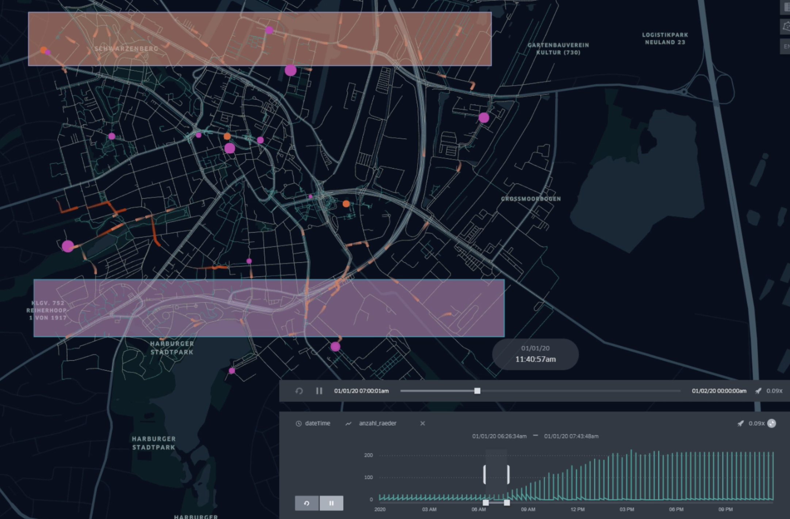
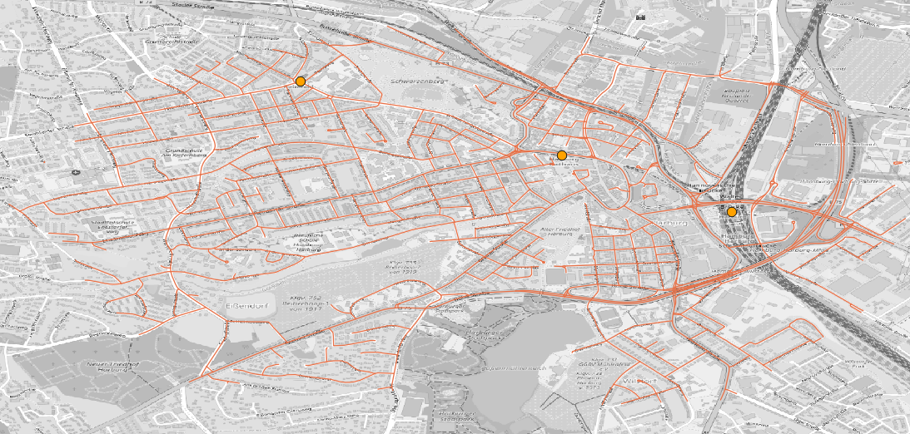

# Green4Bikes
 
* [:floppy_disk: **Windows**](https://git.haw-hamburg.de/mars/model-deployments/-/raw/master/SOHGreen4Bikes/SOHGreen4Bikes_WINDOWS.zip)

* [:floppy_disk: **MacOSX**](https://git.haw-hamburg.de/mars/model-deployments/-/raw/master/SOHGreen4Bikes/SOHGreen4Bikes_MACOSX.zip)

* [:floppy_disk: **Linux**](https://git.haw-hamburg.de/mars/model-deployments/-/raw/master/SOHGreen4Bikes/SOHGreen4Bikes_LINUX.zip) 
 
Green4Bikes simulates the use and consumption of bicycle rental stations in the area around Harbuger Central Station. It will simulate individual inbound and outbound pedestrian traffic where pedestrians use available public bicycles on their way to their mobility destination.

The choice for a bicycle depends on the travel cost savings. If no bicycles are available, the destination must be reached on foot.



### Start the simulation

To run this scenario follow the instructions of your operating system.

##### Windows &#10024;
For Windows users, start the box by calling the following command (the config.json-file in the same folder is used):

```bash
   SOHGreen4Bikes.exe
```

Optionally a different external simulation config can be used with the ``--sm`` parameter:

```bash
   SOHGreen4Bikes.exe --sm config.json
```
    
##### Unix, Mac, Linux &#10024;

To start the box on Unix-based systems, execute the following command (the config.json-file in the same folder is used):

```bash
./SOHGreen4Bikes
```

Optionally a different external simulation config can be used with the ``--sm`` parameter:

```bash
./SOHGreen4Bikes --sm config.json
```

 ---
> &#10071;&#10071;&#10071; There may be problems with the verification of the box and additional files with the extension ``*.dylib`` and ``*.dll``. Please execute the following command in order to make them accessible in your terminal:
 ```bash
xattr -d com.apple.quarantine ./SOHGreen4Bikes
```
---
As soon as the box starts it shows you the current parameterization and stops the simulation. 
Results are stored as trajectories of the agents and can be visualized.

### Rental Station Configuration

New rental stations can be added, moved or removed. The input is done via the ``BicycleRentalLayer`` which expects a vector file as input.

#### Rental Station Input
In the default scenario, the input for rental stations is available in the ``harbug_rental_staions.geojson``. The GeoJSON file can be modified using any text editor or tool (for example [QGIS](https://www.qgis.org/de/site/index.html), [geojson.io](https://geojson.io/#map=12/53.5599/10.0103)). 

To change the input, the mapping for the ``BicycleRentalLayer`` must be adjusted in the configuration file:

```json
{
	"name": "BicycleRentalLayer",
	"file": "harbug_rental_staions.geojson"
}
```

#### Rental Station Edition

MARS is able to output agents, entities and data layers (vector and raster). For the ``BicycleRentalLayer`` this allows the observation of changes at the rental stations and thus the concrete increase and decrease of free bicycles.

To activate the output for the ``BicycleRentalLayer``, the desired output type must be set:

```json
{
	"name": "BicycleRentalLayer",
	"output": "geojson",
	"outputFrequency": 1000,
	"file": "resources/harburg_rental_stations.geojson"
}
```

This configuration creates a snapshot every ``1000`` seconds including the initial state. More settings can be found here.

> It is recommended to always set the output frequency of vector and raster layers, because complete output can lead to a longer runtime.

The following video shows an example scenario for simulating `CycleTraveler` using the `RentalBicycle``s and moving towards a specified destination. It shows the fluent decrease and increase of available rental wheels from north to south: 

> [!Video https://www.youtube.com/embed/MR3-RVlWdxw]

#### Cycle Traveler Scheduling

Traveler can be created at runtime of the simulation and can be configured with source and destination coordinates (equivalent to [Dock Worker](ferry_transfer.md)). We use so-called agent profiles for scheduling, which represent several categories of traveling entities, to keep the setting of the scenario as simple as possible.
 
 * The ``startTime`` (including) and the ``endTime`` (exclusive) each indicate the lower and upper interval bounds in hours of the day. It defines the time range of the day when new cycle traveler workers are created in the simulation and should move towards a target.

* The ``spawningIntervalInMinutes`` (e.g. ``30``, for every half hour) allows to repeat the creation of new traveler from the ``startTime`` to indicate after how many minutes new agents should be created.

* The amount of cycle traveler travelers can be set using the ``spawningAmount`` field (e.g. ``3`` for three new workers) 

* The ``hasOwnBikeProbability`` provides the possibility to create agents that use their own bicycle. The value ``0.0`` let every agent use rental bicycles and the value ``1.0`` gives every agent a personal owned bike. A number in between distributes the possession of bikes (e.g. ``0.5`` let about the half of agents rent and the other half use their own bicycle). Agents with personal bicycles move their complete route with this bike without any walking necessity.

* To describe spawning location and the movement target, the scheduler offers two different parameterization:
    * A concrete source and destination coordinate can be defined in ``WGS84:4326`` notation via the fields ``sourceX`` (longitude) and ``sourceY`` (latitude) for the source and ``destinationX``(longitude) and ``destinationY`` (latitude) for defining the movement target (e.g. ``9.95253, 53.54907``).
    * A source geometry can be defined via the ``source`` field (see polygon areas in figure above) using the ``WKT`` (well-known-text) format with ``WGS84:4326`` notation to designate areas, lines, and points in the simulation world (e.g. B. ``POLYGON((9.976880157282743 53.5447212390353,9.983403289606962 53.54446623736498,9.980656707575712 53.54240066721653,9.976880157282743 53.5447212390353))``). For lines and polygons (areas) the model selects **equidistributed randomly** a coordinate that either lies along the line or is inside the described area. A helpful tool to define own WKT vector or selecting coordinates is the online  [Openlayers](http://dev.openlayers.org/examples/vector-formats.html) tool.

A full example of such a scheduling configuration is showed below and describes the setting above:

|startTime|endTime|spawningIntervalInMinutes|spawningAmount|gender|mass|perceptionnInMeter|hasOwnBikeProbability|source                                                                                                                                                                                                                                                                                       |destination                                                                                                                                                                                                                                                                                                                     |
|---------|-------|-------------------------|--------------|------|----|------------------|---------------------|---------------------------------------------------------------------------------------------------------------------------------------------------------------------------------------------------------------------------------------------------------------------------------------------|--------------------------------------------------------------------------------------------------------------------------------------------------------------------------------------------------------------------------------------------------------------------------------------------------------------------------------|
|7:00     |18:00  |10                       |10            |female|60  |1.0               |1.0                  |MULTIPOLYGON (((9.97859976984082 53.543765731511,9.98209851718183 53.5428480272904,9.98651496874344 53.5427906707766,9.98565462103663 53.5456584964659,9.98261472580592 53.5477233309623,9.97791149167537 53.54617470509,9.97538780506874 53.546461487659,9.97859976984082 53.543765731511)))|MULTIPOLYGON (((9.9038642323762 53.4969628162607,9.91063230100308 53.4898506085511,9.92686419440484 53.4863518612101,9.92760982908407 53.502813180667,9.92072704742962 53.5180700133344,9.90220089347638 53.5195612826928,9.89617845952873 53.5129652836073,9.89331063383937 53.498224659564,9.9038642323762 53.4969628162607)))|

Since ``CycleTraveler`` are equivalent to ``DockWorker`` just without using ``Ferrie``s. Pedestrian movement can be configured additionally to affect walking and running speed, by specifying `gender`, `mass` or the `perceptionInMeter`.

#### Gateways

Traveler can use gateways (here S-Bahn stations) to enter or leave the environment graph if start or goal of the agent are outside the scenario area. Generally, if start/goal is within 1km of the nearest node in the graph, that node is used to enter/leave the graph. If the distance is greater, then a gateway point is used to enter the scenario area. The gateway point that is closest to goal (entering the area) or to start (leaving the area) is chosen as intermediate goal.
The gateways are stored in the ``hamburg_sbahn_stations.geojson`` file. Adding or removing geo-points will allow to change the available gateways for the agents.



--- 

## Analyzing Output

The output of cycle traveler and other parts of the model is described [here](ferry_transfer_green4bikes_results.md)