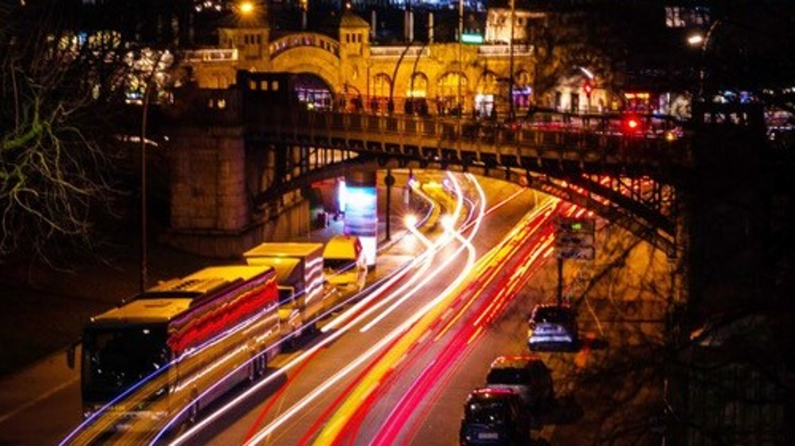

# SOHH: SmartOpenHamburg

The SmartOpenHamburg (SOHH) project is an initiative developed in collaboration with the City of Hamburg to analyze and optimize Hamburg’s transportation system. Here, the transformation of mobility plays a central role: a transport infrastructure in which participants can switch as seamlessly as possible between different public and private transport modalities during their journey should both relieve traffic density within the transport network and promote the sustainability and environmental friendliness of transport.

MARS Group contributes to this project a traffic model of the city of Hamburg in the form of a multi-agent system. The model has a georeferenced digital map of Hamburg’s traffic networks from multiple modalities (including pedestrian, bicycle, car), georeferenced structures and features of the city (buildings, rental bike stations, and various other points of interest within the city), complex pathfinding and movement algorithms to simulate typical traffic events and scenarios, multiple modalities each with its own configuration, and much more.

The SOHH model is in continuous development and strives to be able to simulate a variety of scenarios relevant to traffic and urban planning. Visit us also on our project website [smartopenhamburg.de](https://smartopenhamburg.de/)!

Current SOHH deployments for testing can be found [here](https://mars.haw-hamburg.de/articles/soh/scenarios/index.html).